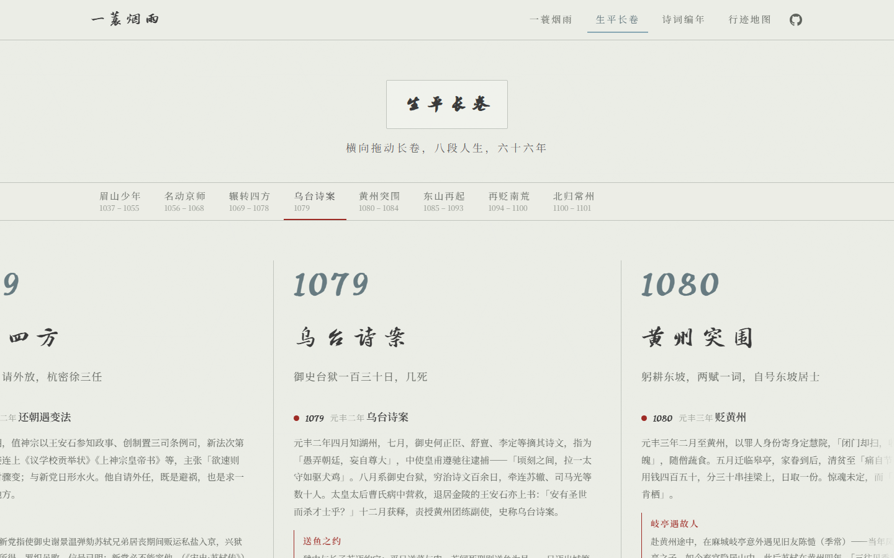
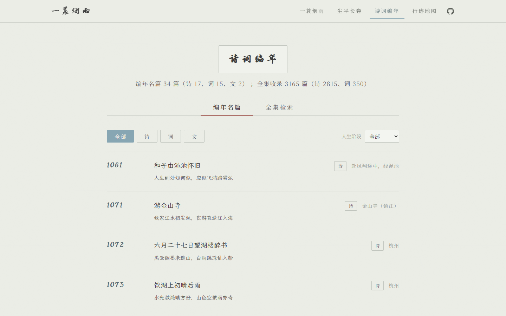
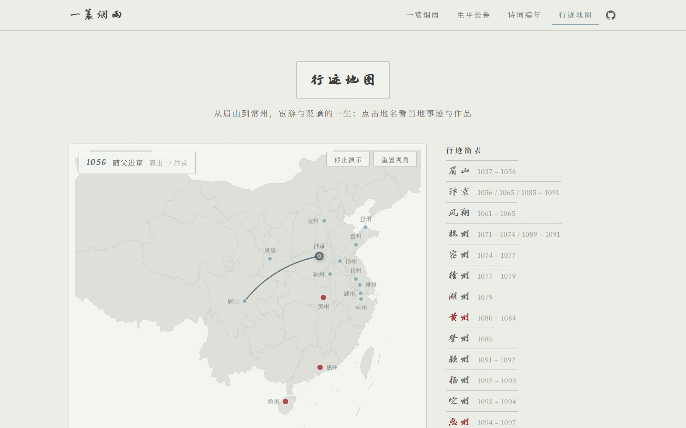

# 一蓑烟雨 · 苏轼编年诗传

> 诗随人走，人以诗传 —— 以编年方式呈现苏轼（1037–1101）的生平与诗词。

| 首页 | 生平长卷 |
|---|---|
|  |  |
| **诗词编年** | **行迹地图** |
|  |  |

在线访问（启用 GitHub Pages 后）：`https://<你的用户名>.github.io/su-shi-chronicle/`

## 功能特性

- **生平长卷**：八段人生、32 个事件节点、17 则有史料出处的轶事（朱批样式，含送鱼之约、金陵会王安石、儋州制墨失火等）；横向卷轴按住拖拽（带惯性滑行），阶段标尺点击居中定位、高亮跟随最左段
- **诗词编年双层**：编年名篇 34 篇（手写背景注，驱动时间轴与地图）+ 全集检索 3165 篇（题名/诗句搜索同时覆盖编年层，体裁与人生阶段筛选，分页浏览）
- **系年推断引擎**：全集 53 篇精确系年（题序年号＋数字、一生唯一的干支）、234 篇阶段推断（任职地名锚定、和陶诗归属惠州儋州），推断依据逐篇朱批展示，无证据者明确标注「未系年」
- **行迹地图**：18 段迁徙路线逐段描线演示（笔尖生长动画，贬谪之路朱砂线），缩放/平移状态在点击与窗口变化时保持，点击地名看当地事迹与作品
- **细节**：名篇简注 31 则、随机名句直达全篇、顶部返回导航、按需加载（首屏 JS gzip 约 40KB）

## 快速开始

```bash
npm install
npm run dev       # 开发模式 http://localhost:5173
npm run build     # 构建到 dist/
npm run preview   # 本地预览构建产物
```

## 数据管道

- 诗词文本来自开源数据集 [chinese-poetry](https://github.com/chinese-poetry/chinese-poetry)（全宋诗 `json/poet.song.*.json` + 全宋词 `宋词/ci.song.*.json` 的苏轼部分），繁体经 [opencc-js](https://github.com/nk2028/opencc-js) 转简体，与编年名篇按词牌＋首句去重
- `node scripts/build-corpus.mjs <chinese-poetry 仓库目录>` 生成 `src/data/poems-full.json`（当前 3165 篇）
- 系年推断为**确定性规则**，非学界编年：题序年号＋数字直接定年；干支在苏轼 65 年人生内 55/60 唯一命中；任职地名锚定阶段区间；和陶诗题中的干支属陶渊明原作年份，已单独修正
- 生平轶事均有出处（《宋史》、邵伯温《邵氏闻见录》、叶梦得《避暑录话》、《东坡志林》及苏轼本人诗文书信），民谚与传说色彩的内容在文中注明

## 字体说明

- 展示层：**方正苏轼行书**，仅通过 CSS `local()` 引用访客本机字体——已安装的设备显示行书，未安装的设备自动回退霞鹜文楷；站点不分发字体文件
- 诗文与界面：霞鹜文楷（lxgw-wenkai-webfont）、思源宋体（@fontsource/noto-serif-sc），均随构建本地化，可自由分发
- ⚠️ 方正字体为商业授权字体，个人学习研究使用免费，但**字体文件不得二次分发**；如需让访客看到行书（字体文件随站点下发），请先取得方正 Web 授权，再运行 `node scripts/build-font-subset.mjs <TTF路径>` 生成子集并在 `src/styles/tokens.css` 的 `@font-face` 中接回 `url()`

## 技术栈

Vue 3 · Vite · vue-router（hash 模式）· ECharts（core 按需引入）· 无后端，纯静态部署

## 部署

GitHub Pages 工作流见 [.github/workflows/deploy.yml](.github/workflows/deploy.yml)：推送到 main 分支后自动构建并发布。仓库设置中 Pages → Source 选择 **GitHub Actions** 即可。

## License

[MIT](LICENSE)（代码）。诗词文本为公有领域古籍；数据集 chinese-poetry 遵循其 MIT 许可；涉及的字体按各自授权使用（见「字体说明」）。
